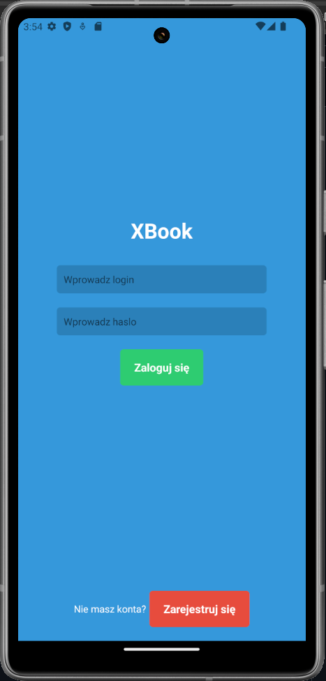
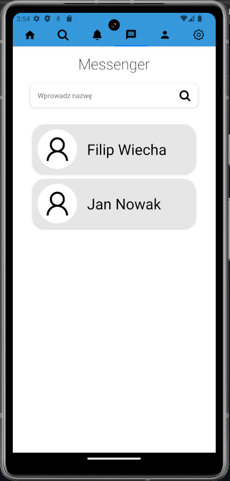
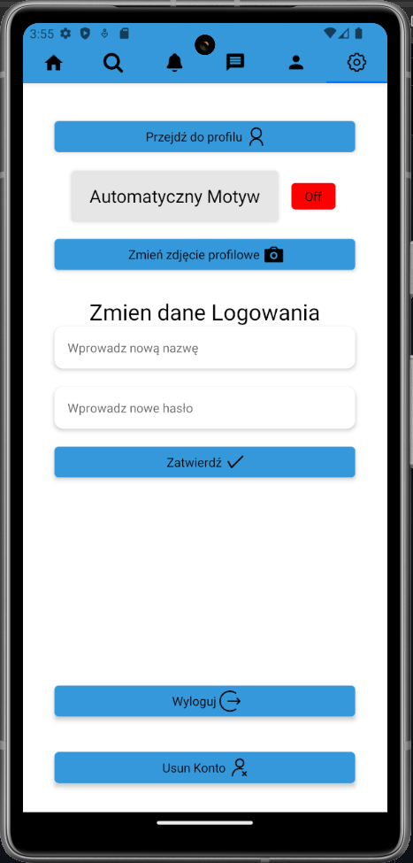

# SocialApp

SocialApp to aplikacja społecznościowa inspirowana funkcjonalnością Facebooka, umożliwiająca użytkownikom komunikację, udostępnianie treści oraz interakcję ze znajomymi.

## Funkcje

### Rejestracja i logowanie

- Użytkownicy mogą założyć nowe konto poprzez formularz rejestracyjny, podając podstawowe dane osobowe.
- Istnieje możliwość logowania się za pomocą adresu e-mail oraz hasła.

### Profil użytkownika

- Każdy użytkownik posiada swój profil, na którym może wyświetlać informacje o sobie, zdjęcia oraz aktywność na platformie.

### Posty i komentarze

- Użytkownicy mogą dodawać nowe posty na swojej tablicy.
- Możliwość polubienia postów.

### Prywatne wiadomości

- Funkcjonalność prywatnych wiadomości umożliwia użytkownikom bezpośrednią komunikację z innymi użytkownikami.

### Motyw

- Możliwość ustawienia automatycznego motywu

## Technologie

- React Native
- JavaScript

## Instalacja

1. Sklonuj repozytorium na swoje urządzenie.
2. Uruchom projekt za pomocą komendy `npx expos start`.
3. Uruchom server JSON za pomocą komendy `json-server --watch db.json --port 3004 --host <adres ip>`.
4. W pliku ekrany/aktualizacja ustaw adres serwera JSON.
5. Otwórz aplikacje za pomocą Android Studio lub expo go

## Wygląd

###
###
###

